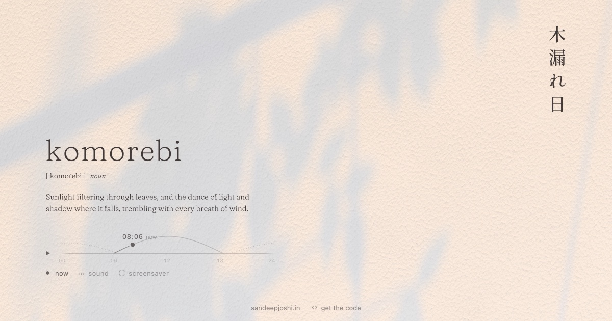

# komorebi

木漏れ日, sunlight filtering through leaves, on a sheet of cold-press watercolour
paper, in the browser, at your own time of day. By night the moon takes over and
the words become 木漏れ月, komorezuki. Now and then a sparrow comes to the shrub
by the window.

**Live:** https://komorebi-light.vercel.app



## Run it

```bash
npm install
npm run dev
```

Then open http://localhost:5181. `npm run build` writes a static site to `dist`
that any static host can serve.

In the address, `#clock=17.5` opens at a given time (otherwise the light follows
your clock), and `#screensaver` shows the light alone.

## As a screensaver or wallpaper

"screensaver" on the page shows the light alone, full screen, and keeps the
screen awake; any key or movement brings the page back.

To make it your computer's screensaver or wallpaper, give an app that shows web
pages the address https://komorebi-light.vercel.app/#screensaver (or your own
build's):

- **macOS screensaver:** [WebViewScreenSaver](https://github.com/liquidx/webviewscreensaver),
  then System Settings › Screen Saver › WebViewScreenSaver › Options, and add the
  address.
- **macOS wallpaper:** [Plash](https://sindresorhus.com/plash), and add the address
  as a website.
- **Windows wallpaper:** [Lively Wallpaper](https://www.rocksdanister.com/lively/),
  and add the address as a web page.

## How it works

- **The light** (`src/light`, three.js with GLSL). The paper lies flat with the
  window behind you. For every point of the paper the shader integrates over the
  sun's disc: each direction toward the sun passes the window's rail, the visiting
  bird, a balcony shrub 45 cm away, a garden tree at 3 m and far crowns at 9 m. So
  shadows soften with distance as real ones do, and gaps in the far canopy cast
  round images of the sun.
- **The paper** is a height field (its grain and fibre from Paper Shaders),
  lit by the same light, so its tooth rises in raking light, casts small shadows
  when the sun is low and settles in the shade. A logarithmic highlight roll-off
  keeps soft shadows and thin twigs visible.
- **The day** (`settings.js`, `daylight.js`) is a few art-directed moments,
  between which every value follows a monotone curve: rose at sunrise, near white
  at noon, gold in the late afternoon, a street lamp at blue hour, then the moon.
- **Wind** moves in layers, trunk slow, branches medium, leaves quick, with gusts
  travelling across. Everything is a function of time and a seed, so any frame
  can be reproduced.
- **The bird** (`bird.js`) is a sparrow modelled in 3D and projected along the
  sun. It comes down along the light, lands on a twig that dips under its weight,
  looks about, preens and leaves.
- **The words** (`src/dissolve`) are drawn as ink: written in on arrival, lifted
  where the pointer passes and settling back. The page's own text stays in place,
  transparent, for selection and screen readers.
- **The time of day** (`src/sunpath.js`) is the sky itself: the sun's arc over the
  horizon by day and the moon's by night, and on them the sun or the moon, which is
  what you move. It springs to where you press, follows the hand, glides on when
  flicked, and holds a little at sunrise, sunset and your own time. A native range
  input lies over it, so keyboard, touch and assistive technology work.
- It adapts its quality to the device, and has fallbacks for reduced motion and
  for browsers without WebGL2.

## Recording clips

`clips/clips.js` holds the choreography of the clips posted with the page. With
the development server running and the browser's view at 960 × 540 (device pixel
ratio 2), in the page's console:

```js
const { record } = await import('/clips/clips.js');
await record('day');
```

Frames and the music go to `captures/clip-day`. On macOS, encode them with:

```bash
swiftc -O tools/encodeav.swift -o tools/encodeav
tools/encodeav captures/clip-day 30 captures/clip-day/track.wav komorebi-day.mp4
```

## Credits and licences

By [Sandeep Joshi](https://sandeepjoshi.in). The code is under the MIT licence
(`LICENSE`), except:

- `src/light/shaders/paper.frag` contains `getRoughness()` and `getFiber()` from
  [Paper Shaders](https://shaders.paper.design)' Paper Texture shader
  (@paper-design/shaders 0.0.81, Copyright 2026 Paper), Apache License 2.0
  (`third-party/paper-shaders`).
- Fraunces Voice (`public/fonts`) is Fraunces with its optical size, softness and
  wonk fixed (`scripts/instance-font.py`), under the SIL Open Font License
  (`public/fonts/OFL.txt`). 木漏れ日 and 木漏れ月 are set in Shippori Mincho, and two
  IPA letters in Noto Serif, both from Google Fonts.
- The music is Erik Satie's Gymnopédie No. 1, played by Robin Alciatore, a public
  domain recording from [Musopen](https://musopen.org), via
  [Wikimedia Commons](https://commons.wikimedia.org/wiki/File:Erik_Satie_-_gymnopedies_-_la_1_ere._lent_et_douloureux.ogg).
